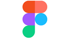

# Design toolkits and samples for Windows apps

This topic provides a variety of design and UI-related resources for creating visually appealing and user-friendly Windows applications. For more downloads, including development tools such as Visual Studio, see [Downloads and tools for Windows development](https://developer.microsoft.com/windows/downloads).

## Toolkits and libraries

:::row:::
    :::column:::
        
    :::column-end:::
    :::column:::
        
    :::column-end:::
    :::column:::
        
    :::column-end:::
    :::column:::
        
    :::column-end:::
:::row-end:::
:::row:::
    :::column:::
        **Figma Toolkit** 
        Windows Design Kit, November 2024 
        [Open the toolkit](https://aka.ms/WinUI/3.0-figma-toolkit)
    :::column-end:::
    :::column:::
        **WinUI** 
        Controls and other UI elements for Windows apps. 
        [Installation instructions](/uwp/toolkits/winui/getting-started)
    :::column-end:::
    :::column:::
        **Windows Community Toolkit** 
        Helper functions, custom controls, and app services. 
        [Installation instructions](/windows/uwpcommunitytoolkit/getting-started)
    :::column-end:::
    :::column:::
        **Template Studio** 
        Accelerate the creation of new WinUI, WPF, and UWP apps using a wizard-based experience. 
        [Installation instructions](https://github.com/microsoft/TemplateStudio#template-studio)
    :::column-end:::
:::row-end:::

## WinUI Gallery app

Get the *WinUI Gallery* apps from the Microsoft Store to see XAML controls and the [Fluent Design System](https://developer.microsoft.com/fluentui#/) in action. The **WinUI 3 Gallery** and **WinUI 2 Gallery** apps include interactive examples of most WinUI 3 and WinUI 2 controls, features, and functionality. The apps are an interactive companion to this website. When you have them installed, you can use links on individual control pages to launch the app and see the control in action.

> [!div class="checklist"]
>
> - Get the [**WinUI 3 Gallery**](https://www.microsoft.com/store/productId/9P3JFPWWDZRC) and the [**WinUI 2 Gallery**](https://www.microsoft.com/store/productId/9MSVH128X2ZT) from the Microsoft Store.
> - Get the source code for both from [GitHub](https://github.com/Microsoft/WinUI-Gallery) (use the *main* branch for WinUI 3 and the *winui2* branch for WinUI 2).

## Fonts

The Windows type system helps you create structure and hierarchy in your content in order to maximize legibility and readability in your UI (for more details, see [Segoe UI font family](/typography/font-list/segoe-ui)).

The following fonts are recommended:

- [Segoe UI Variable](https://aka.ms/SegoeUIVariable) (see [Typography in Windows](../signature-experiences/typography.md))
- [Segoe Fluent Icons](https://aka.ms/SegoeFluentIcons) (see [Segoe Fluent Icons font](../style/segoe-fluent-icons-font.md))
- [Segoe UI](https://aka.ms/segoeuifont)
- [Segoe MDL2](https://aka.ms/segoemdl2) (see [Segoe MDL2 Assets icons](../style/segoe-ui-symbol-font.md))

## Tools

:::image type="content" source="images/tile-icon-generator.png" alt-text="Screenshot of Adobe Photoshop with the Tile and icon generator actions in progress.":::

You can use the **Tile and icon generator for Adobe Photoshop** actions to generate the 68 recommended tile and icon assets from just 7 files (see the [Tile and Icon Generator Demo](/shows/build-2016/t632)).

<a href="https://download.microsoft.com/download/B/5/F/B5F22952-44DF-46EC-820B-11951AE01AEC/UWP tile and icon asset generator.zip">Download the tile and icon generator actions</a>

## Samples

The following samples include a variety of visually appealing and user-friendly interfaces.

**Fluent XAML Theme Editor**

The Fluent XAML Theme Editor is a tool that helps demonstrate the flexibility of the [Fluent Design System](https://developer.microsoft.com/fluentui#/) and supports the app development process by generating XAML markup for our ResourceDictionary framework used in Windows applications.

<a href="https://github.com/Microsoft/fluent-xaml-theme-editor/archive/master.zip">Download the tool sample</a>

<a href="https://github.com/Microsoft/fluent-xaml-theme-editor">Check out the tool on GitHub</a>

**VanArsdel**

The Van Arsdel, Ltd. end-to-end Windows sample app was built to showcase the next wave of the [Fluent Design System](https://developer.microsoft.com/fluentui#/). It makes extensive use of the improved density and new controls in the <a href="/windows/apps/winui/">WinUI</a> as well as powerful underlying features of the UX framework and composition. The sample shows how you can build a rich, productive experience for managing and purchasing IoT devices (in this case, lamps).

<a href="https://github.com/Microsoft/VanArsdel/archive/master.zip">Download the VanArsdel sample</a>

<a href="https://github.com/microsoft/vanarsdel">Check out the VanArsdel sample on GitHub</a>

**BuildCast**

BuildCast is an end-to-end sample built to showcase the [Fluent Design System](https://developer.microsoft.com/fluentui#/) and Windows. It permits browsing, downloading, and playback of select video podcasts, including some Windows tech enthusiast feeds. It also features ink notes, bookmarks, and remote playback. This sample was initially shown at the 2017 Build conference during the Build Amazing Apps with Fluent Design talk.

<a href="https://github.com/Microsoft/BuildCast/archive/master.zip">Download the BuildCast sample</a>

<a href="https://github.com/Microsoft/BuildCast">Check out the BuildCast sample on GitHub</a>

**Lunch Scheduler**

A Windows app sample that schedules lunches with your friends and coworkers. You create a lunch reservation, invite friends to a restaurant of interest, and the app takes care of the lunch management for everyone. This app incorporates elements of the [Fluent Design System](https://developer.microsoft.com/fluentui#/), including acrylic, reveal, and connected animations.

<a href="https://github.com/Microsoft/Windows-appsample-lunch-scheduler/archive/master.zip">Download the Lunch Scheduler sample</a>

<a href="https://github.com/Microsoft/Windows-appsample-lunch-scheduler">Check out the Lunch Scheduler sample on GitHub</a>
  

### Want more code?

Check out the [Windows sample page](https://developer.microsoft.com/windows/samples) for complete list of all our Windows app samples.
