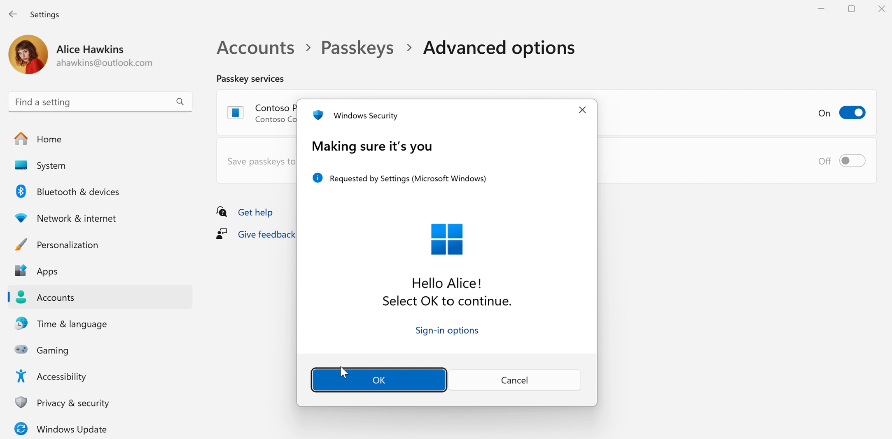
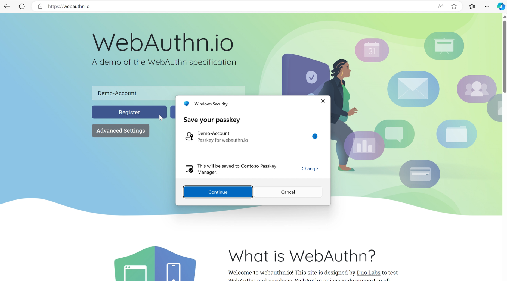
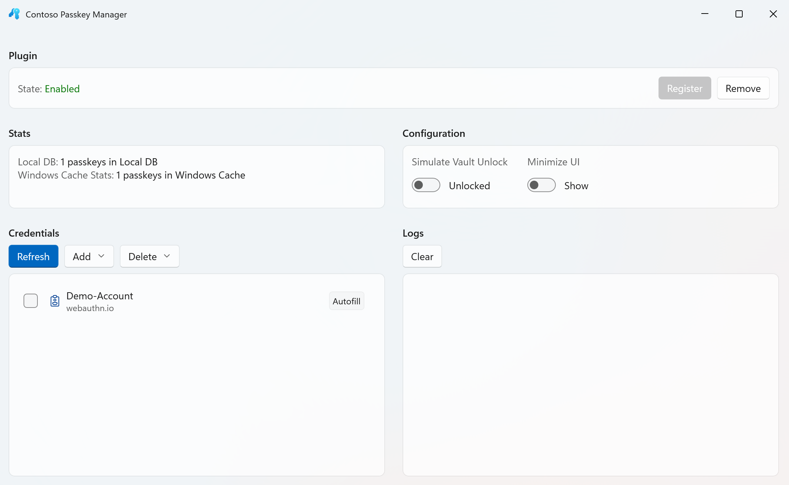
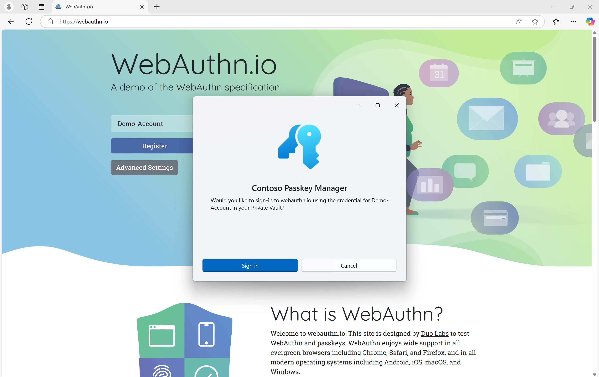

# Third-party passkey manager support

This topic describes the third-party credential manager API plugin support for third-party passkey providers on Windows. It showcases a demo app named Contoso Passkey Manager.

## Contoso Passkey Manager

Windows 11 supports a third-party plugin model for passkeys. Contoso Passkey Manager is a demo app that demonstrates this passkey provider support.

> [!WARNING] 
> Contoso Passkey Manager is designed for passkey creation and usage testing only. Don't use the app for production passkeys.

### Step 1: Installation

1. Set up your development environment for WinUI 3 development (see [Install tools for the Windows App SDK](/windows/apps/windows-app-sdk/set-up-your-development-environment)).
2. Clone the Windows-classic-samples GitHub repo for the [Contoso Passkey Manager sample](https://github.com/microsoft/Windows-classic-samples/tree/main/Samples/PasskeyManager) app.
3. In Visual Studio, open the Contoso Passkey Manager solution that you just cloned, carefully follow the instructions at the link above, build the sample, and then run it to confirm installation.

### Step 2: Setup

1. Go to **Settings** > **Accounts** > **Passkeys**, and then **Advanced options**.
2. Switch the toggle to **On** for Contoso Passkey Manager.
3. Complete the Windows Hello user verification, and now you can save passkeys to the Contoso Passkey Manager.

### Step 3: Passkey creation

1. Navigate to a website such as [webauthn.io](https://webauthn.io/).
2. Create a test user name, and click **Register**.
3. You will be prompted, on saving your passkey, with the Contoso Passkey Manager. Click **Continue**.

4. The Contoso Passkey Manager app will open. Click **Create** to create the credential in Contoso Passkey Manager.
5. Complete user verification with Windows Hello, and the passkey is created.
6. You can see your saved passkeys by opening the Contoso Passkey Manager.
7. If you want to test different experiences, then you can toggle **Simulate Vault Unlock** to test a vault unlock user experience when saving a passkey. The **Minimize UI** toggle simplifies the step that opens the passkey manager, and the experience flow will instead just be with user verification on Windows Hello.

### Step 4: Passkey authentication

1. Input your username, and click **Authenticate**.
2. Select to sign in with the passkey saved to the Contoso Passkey Manager.

3. Complete user verification with Windows Hello to authenticate.
4. You've successfully logged in.

## Next steps

To integrate with the third-party plugin capability, go to [webauthn](https://github.com/microsoft/webauthn) to find the header files.

## See also

* [WebAuthNGetPlatformCredentialList](/windows/win32/api/webauthn/nf-webauthn-webauthngetplatformcredentiallist)
* [webauthn.h header](/windows/win32/api/webauthn/)
