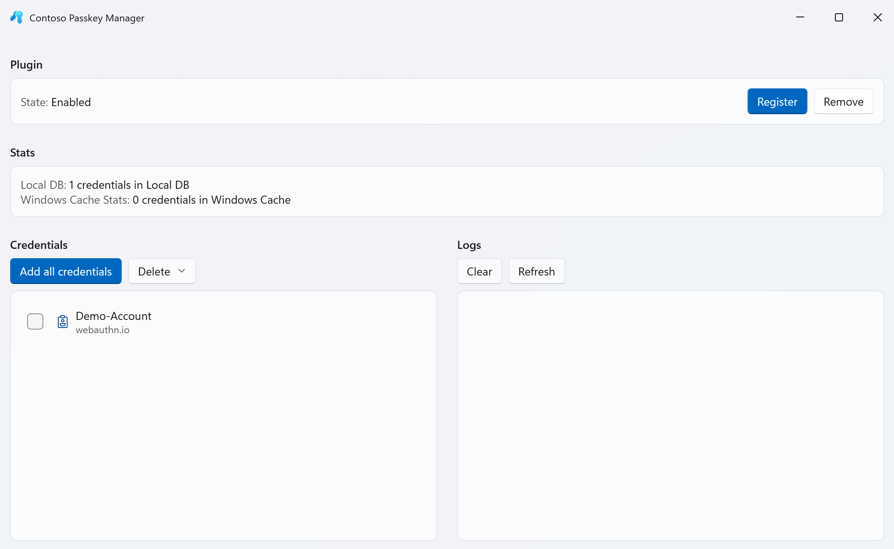

# Third-Party Passkey Manager Support

This topic describes the new third-party credential manager support for passkeys on Windows and the Contoso Passkey Manager demo app.

## Contoso Passkey Manager Demo App
Windows 11 supports a third-party plugin model for passkeys. The Contoso Passkey Manager test app demonstrates this passkey provider support.

> [!WARNING] 
> The Contoso Passkey Manager is designed for passkey creation and usage testing only. Do not use the app for production passkeys.

#### Step 1: Installation
1. Set up your development environment for WinUI 3 development (see [Install tools for the Windows App SDK](/windows/apps/windows-app-sdk/set-up-your-development-environment?tabs=cs-vs-community%2Ccpp-vs-community%2Cvs-2022-17-1-a%2Cvs-2022-17-1-b)).
2. Clone the Contoso Passkey Manager [repo](https://aka.ms/3PDemoApp).
3. In Visual Studio, open the Contoso Passkey Manager solution, build it, and run to confirm installation.

#### Step 2: Set up
1. Go to Settings, Accounts, Passkeys, then Advanced options.
2. Select the toggle to be "On" for Contoso Passkey Manager.
3. Complete Windows Hello user verification and now you can save passkeys to the Contoso Passkey Manager!

#### Step 3: Passkey Creation
1. Navigate to a website such as [webauthn.io](https://webauthn.io/).
2. Create a test user name and click Register.
3. You will be prompted on saving your passkey with the Contoso Passkey Manager. Click "Continue".

4. The Contoso Passkey Manager app will open, click "Create" to create the credential in the demo app.
5. Complete user verification with Windows Hello and the passkey is created!
6. You can see your saved passkeys by opening the Contoso Passkey Manager.

#### Step 4: Passkey Authentication
1. Input your username and click "Authenticate".
2. Select to sign in with the passkey saved to the Contoso Passkey Manager.

3. Complete user verification with Windows Hello to authenticate.
4. Success! You have logged in.

## Next steps

To integrate with the third-party plugin capability go to [webuathn](https://github.com/microsoft/webauthn) to find the header files.

Additional resources: 
- [WebAuthNGetPlatformCredentialList - Win32 apps | Microsoft Learn](/windows/win32/api/webauthn/nf-webauthn-webauthngetplatformcredentiallist)
- [webauthn.h header - Win32 apps | Microsoft Learn](/windows/win32/api/webauthn/)
